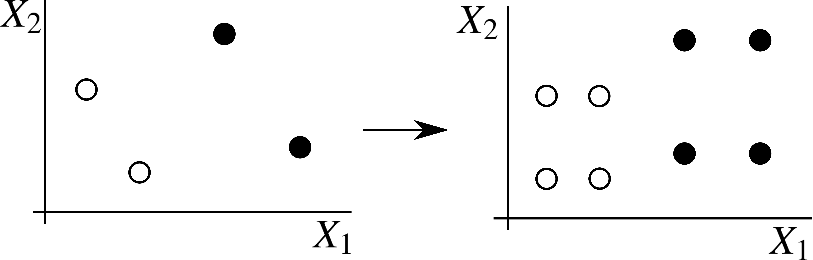
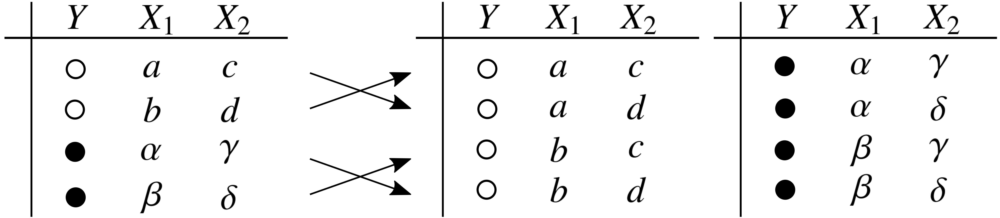

# Causal Data Augmentation --- Incorporating causal graphical prior knowledge into predictive modeling via simple data augmentation.

[](./LICENSE)
[](https://takeshi-teshima.github.io/incorporating-causal-graphical-prior-knowledge-into-predictive-modeling-via-simple-data-augmentation/index.html)

## Introduction
How can we use the causal knowledge obtained by causal discovery to improve machine learning?
Are causal discovery methods beneficial for machine learning tasks?

* **Causal data augmentation** <sup>[1](#references)</sup>
  A simple data augmentation method to incorporate the knowledge encoded in a causal graph into supervised learning.

  <div align="center">
  
  
  </div>

  * Simple and model-independent: the method can be combined with virtually any supervised learning method, as long as it supports instance-weighted learning.
  * Theoretically well-grounded: generalization error bound implying that the method reduces the apparent complexity of the predictor hypothesis class.

## Requirements
* Python 3.6+
* See [requirements.txt](./requirements.txt) for the others.

## Install
```bash
$ pip install git+https://github.com/takeshi-teshima/incorporating-causal-graphical-prior-knowledge-into-predictive-modeling-via-simple-data-augmentation

$ pip install -r requirements.txt
$ pip install -r requirements-no-deps.txt --no-dependencies

# To reproduce the experiments of our UAI2021 paper:
$ pip install -r experiments/uai2021/requirements.txt
```

OR clone this repository and run
```bash
$ pip install .
```
and the package will be installed under the name of `causal-data-augmentation` (the module name will be `causal_data_augmentation`).


## Usage
[Documentation](https://takeshi-teshima.github.io/incorporating-causal-graphical-prior-knowledge-into-predictive-modeling-via-simple-data-augmentation/index.html)

## Experiments
See [experiments/uai2021/README.md](experiments/uai2021/README.md).

## License
This project is licensed under the terms of the [Apache 2.0 license](./LICENSE).

## References
<!-- This header title is used as an anchor tag somewhere else in this README.md -->
If you use the code in your project, please consider citing:


[1] Teshima, T. and Sugiyama, M. (2021). [Incorporating causal graphical prior knowledge into predictive modeling via simple data augmentation](https://arxiv.org/abs/2103.00136) ([UAI 2021](https://www.auai.org/uai2021/)).

```
@InProceedings{Teshima2021Incorporating,
    title = {Incorporating causal graphical prior knowledge into predictive modeling via simple data augmentation},
    author = {Teshima, Takeshi and Sugiyama, Masashi},
    booktitle = {Proceedings of the 37th Conference on Uncertainty in Artificial Intelligence (UAI)},
    year = {2021}
}
```

## Problems?
- If you encounter any problem using the code in this repository or have suggestions for improvements, please do us a favor by ticketing an issue!

## Notes
* In case you encounter any issues regarding the requirements,
  a full list of the installed packages in a working environment can be found at [requirements-full.txt](./requirements-full.txt) (the output of `$ pip freeze`).
* The code released along with the paper [1] will be preserved in the branch `uai2021`.
